# design-c#-project

## Проект для курса проектирование на c#

## Команда:

+ ### Батуев Макар РИ-300019
+ ### Сычков Илья РИ-300003
+ ### Дорохов Сергей РИ-300018

## Что готово в Api:

+ #### Реализована авторизация через УрФУ
+ #### Получение оценок пользователя и информации о нём
+ #### Использован DI контейнер, встроенный в asp.net
+ #### Использовали паттерн Mediatr
+ #### Реализован ddd
+ #### Добавлена база данных PostgreSQL + миграции на EntityFramework
+ #### Api и база данных упакованы в docker
+ #### В Api добавили авторизованную зону(нельзя отправлять запросы без приложенного jwt token-а) + добавили в свагер авторизацию bearer jwt
+ #### Написаны тесты на сервисы, которые мы используем в Domain

## Структура Api:

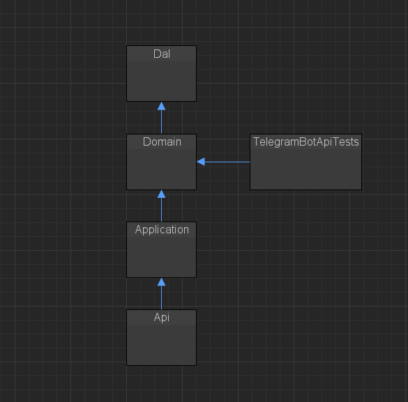

## Тесты в Api:

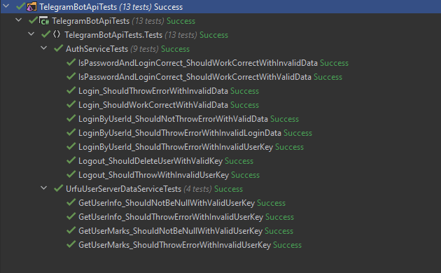

## Сценарий использования Api:

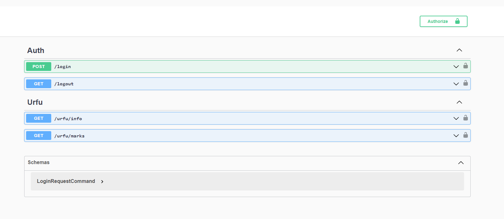

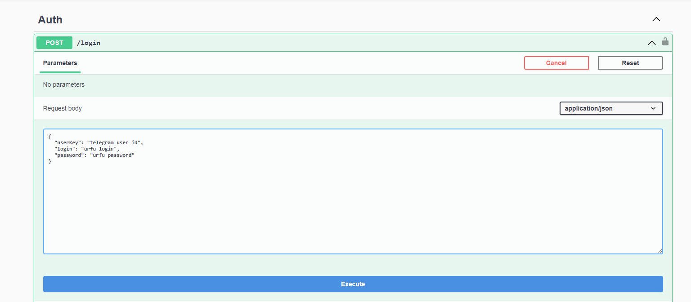

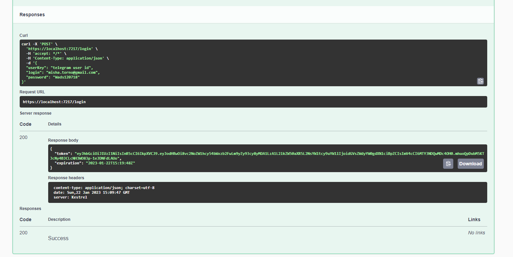

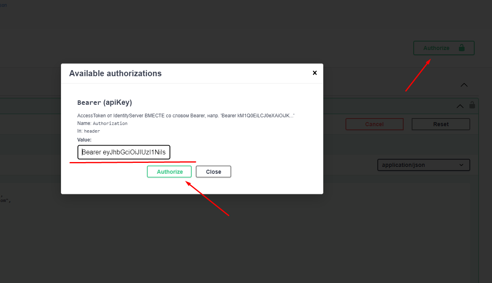

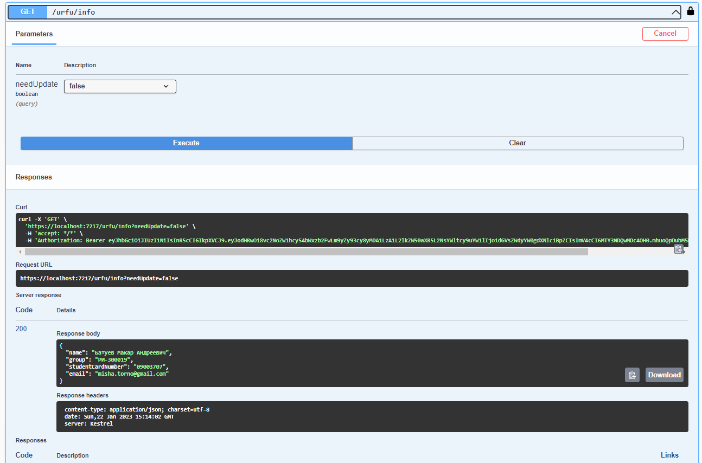

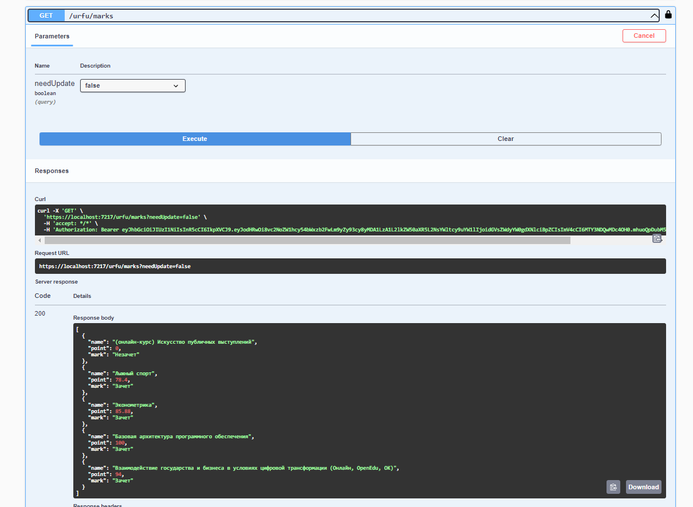

## Точки расширение Api:

+ #### Добавление других разделов сайта УрФУ
+ #### Добавление ботов других социальных сетей
+ #### Возможность создания публичного api

## Что хотели бы добавить в Api:

+ #### Добавить миграции в докер
+ #### Добавить logger
+ #### Добавить обработчик ошибок
+ #### Long polling

## Что готово в telegram bot:

+ #### Наличие и рабочее состояние бота в телеграме
+ #### Взаимодействие бота с пользователем
+ #### Команды бота
+ #### Состояния бота
+ #### Паттерн "Команда"
+ #### Паттерн "Машина состояний"
+ #### Di-container
+ #### Реализован DDD
+ #### Упакован в докер

## Структура telegram bot:

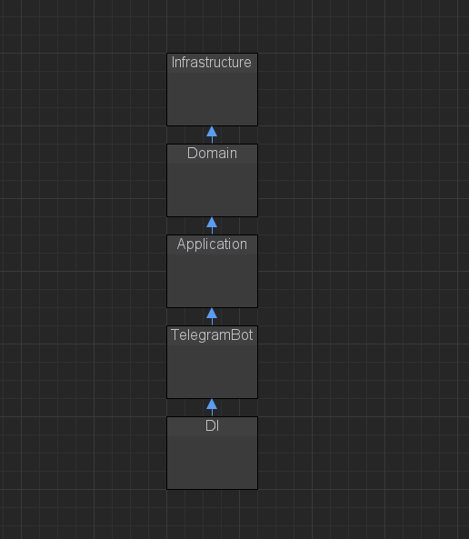

## Реализация паттернов telegram bot:
+ #### Паттерн "Команда"

Интерфейс ICommand

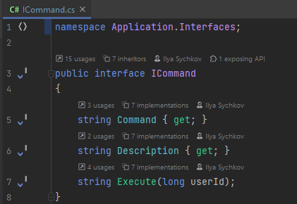

Реализация интерфейса
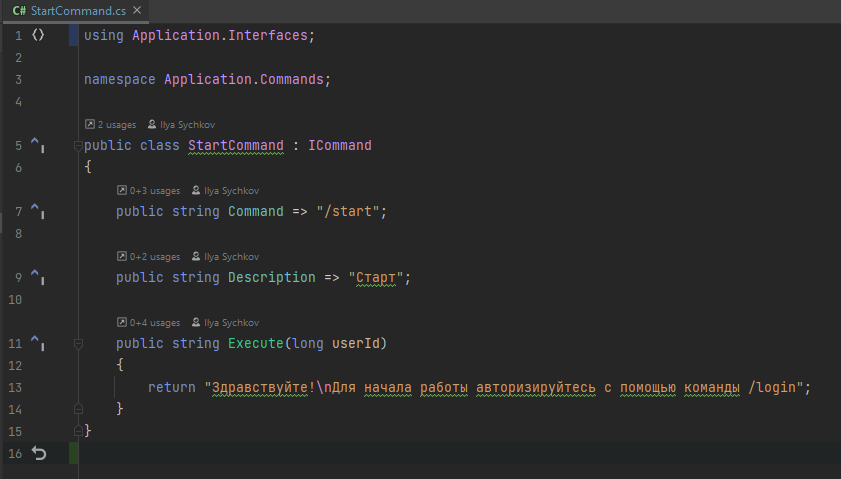

Все реализации

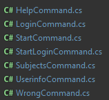

Списки команд
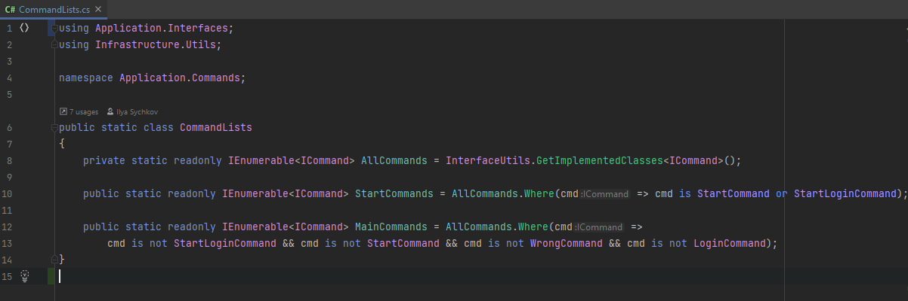

Получение команды из текста
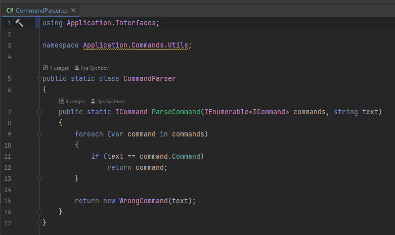

Использование команды
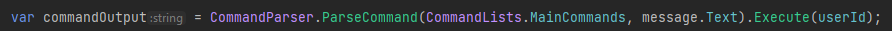

+ #### Паттерн "Машина состояний"
Машина состояний
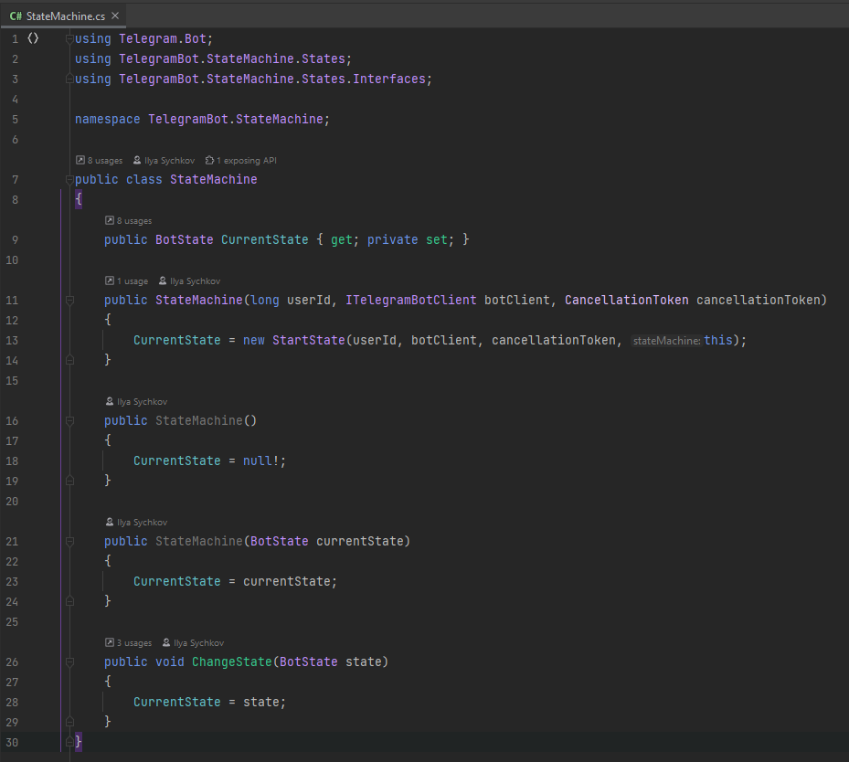

Абстрактный класс состояния бота
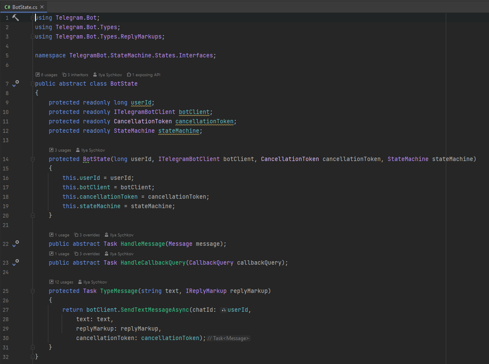

Каждое состояние разное
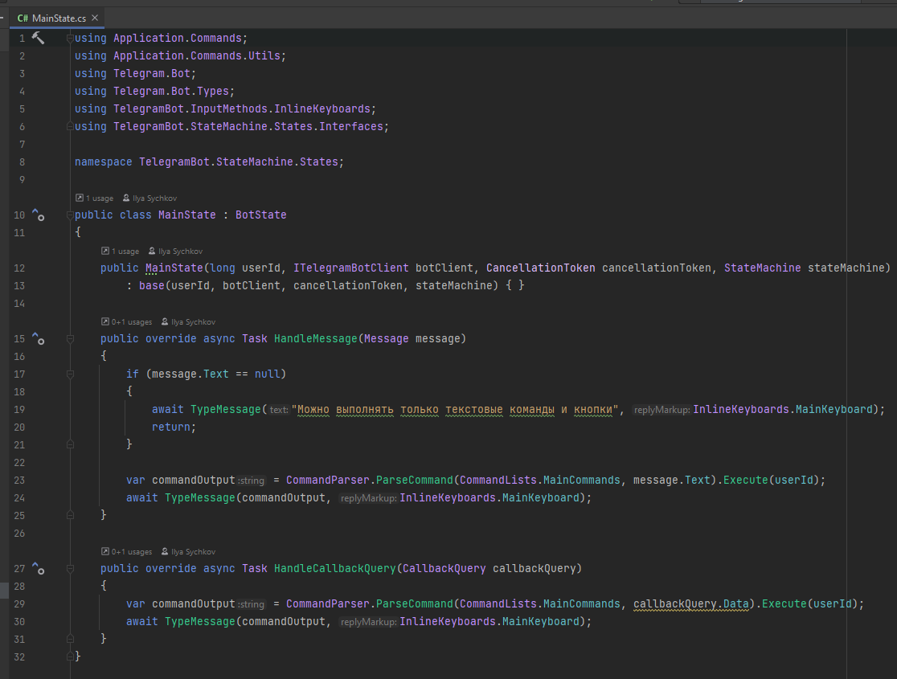

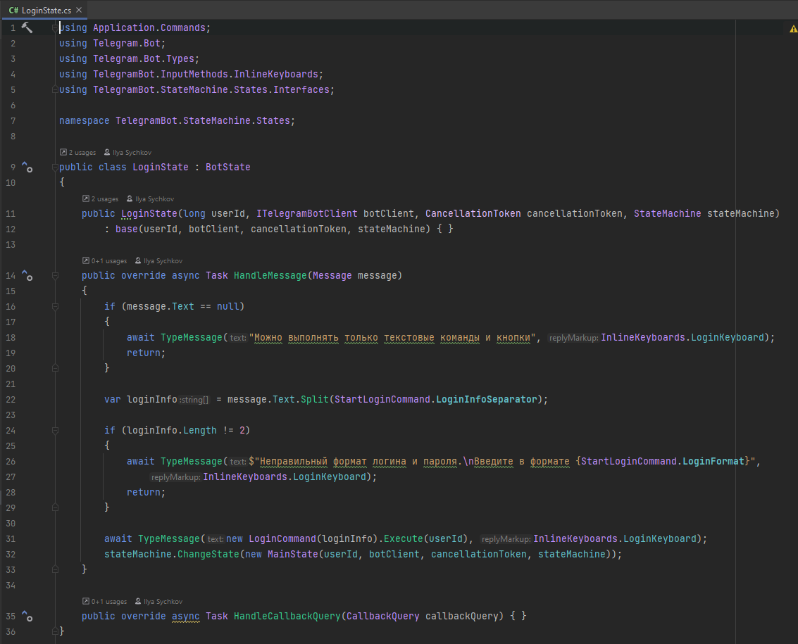

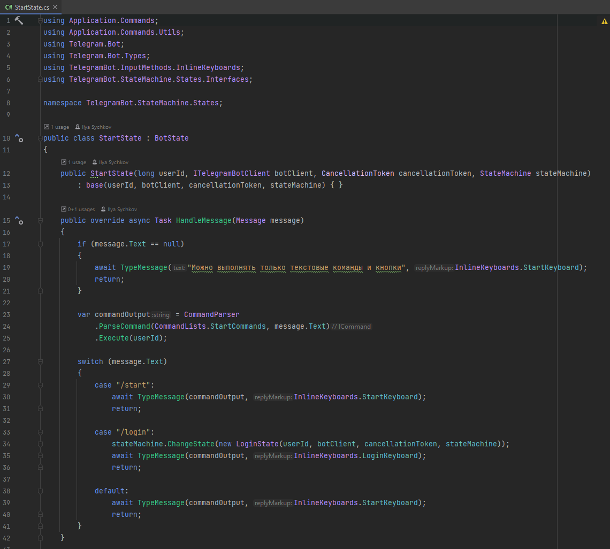

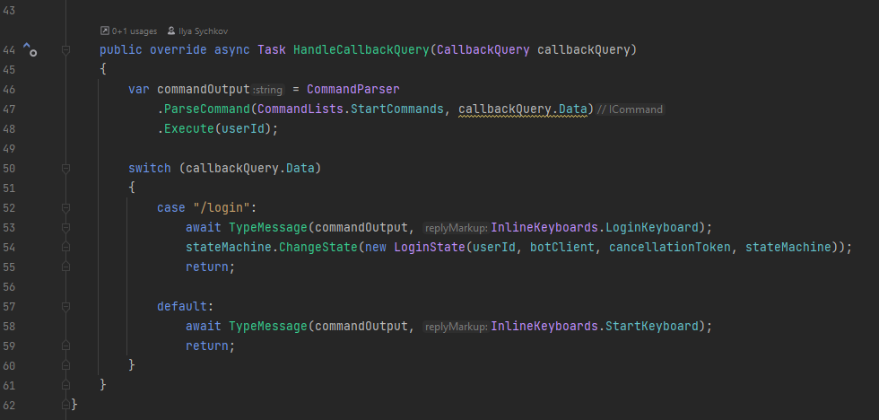

Словарь машин состояний для каждого пользователя
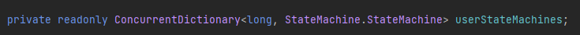

Реализация машины состояний
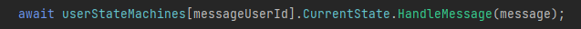
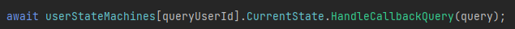

## Точки расширение telegram bot:

+ #### Добавление новых команд бота
+ #### Добавление новых состояний бота со своими клавиатурами и списком команд
+ #### Добавление новых клавиатур и других методов ввода команд
+ #### Изменение формата вывода комманд

## CI\CD:
### CI - Continuous Integration
При создании мр на ветку main срабатывает триггер github action, после чего проект собирается на виртаульной машине и прогоняются все тесты.
(* файл конфигурации ".github/workflows/dotnet.yml")

## Что хотели бы добавить в telegram bot:

+ #### Соеденить api с ботом
+ #### Добавить logger
+ #### Добавить Redis
+ #### Добавить тесты

